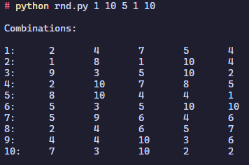

# RANDOMINIUM

- A small library of tools for generating random data.

# Using

### Iterations of random numbers
```shell
python rnd.py <cf> <ct> <n> <nf> <nt>
```
```
 cf - countFrom  
 ct - countTo 
 n  - numberOfElements 
 nf - numberFrom 
 nt - numberTo 
```

